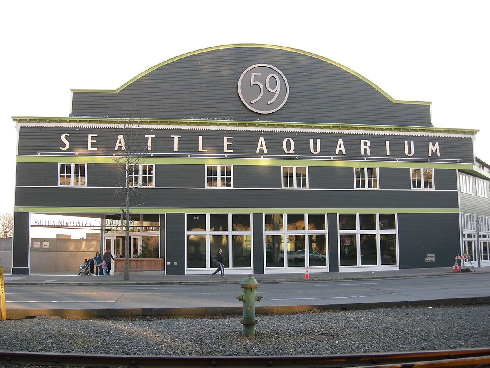
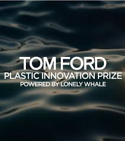
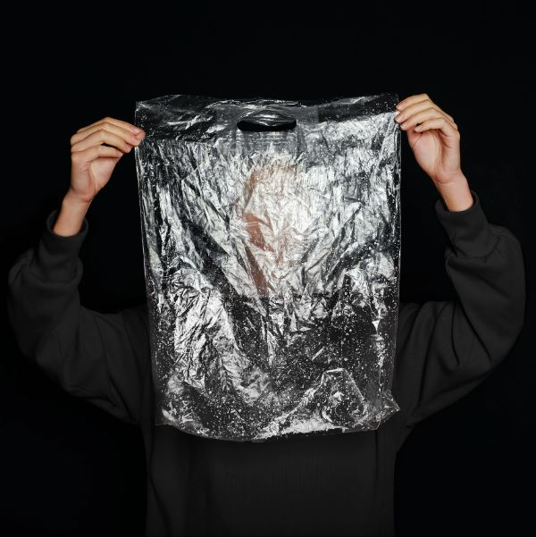
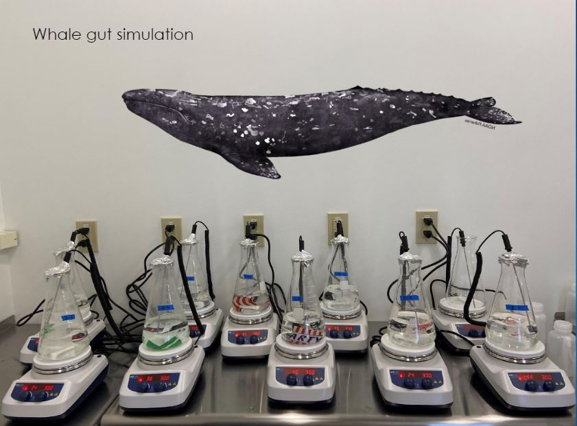

# Seattle Aquarium Plastic Innovation Prize Whale Gut Simulation
This repository contains all code and data associated with the Seattle Aquarium Plastic Innovation Prize (PIP) Whale Gut Simulation. 

This research was published in Marine Pollution Bulletin in September, 2024, in an open-source article titled: [Persistent plastic: Insights from seawater weathering and simulated whale gut](https://www.sciencedirect.com/science/article/pii/S0025326X24007653?via%3Dihub).

  
   

  
   

